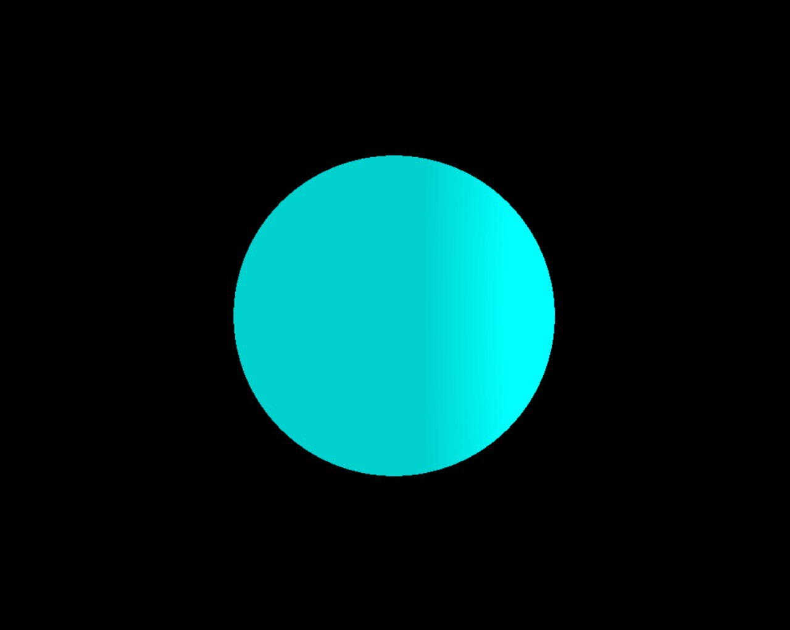

# miniRT (42 project)
My first RayTracer with MinilibX
## Description
Aim of this project is to create raytraced image using MinilibX grafic library. \
This program has 3 basic shapes:
1. Cylinder
2. Plane
3. Sphere
Feature of ray traycing that were implemented:
1. Figure's intersection
2. Ambient lightning
3. Diffuse lightning
4. Specular lightning
## Game rules
The only argument of the program is a configuration file .rt that consist of:
1. Ambient lightning \
`A [coordinates] [RGB color]`
2. Camera \
`C [coordinates] [3d normalized vector]`
3. Light \
`L [coordinates] [intensity]`
4. Spehere \
`sp [coordinates of center] [diameter] [RGB color]`
5. Plane \
`pl [coordinates] [3d normalized vector] [RGB color]`
6. Cylinder \
`cy [coordinates] [3d normalized vector] [diameter] [height] [RGB color]`
## Launching
Run `make` to compile \
Run `./miniRT [map]` to see the result \
(Examples of map are in scenes directory)
## Examples
### Plane

### Spehere

### Cylinder

### MIX (With broken colors that are fixed, but I like it)

## Command
[**Me (andreymp)**](https://github.com/andreymp) \
[**Heveline**](https://github.com/daria-k15)
